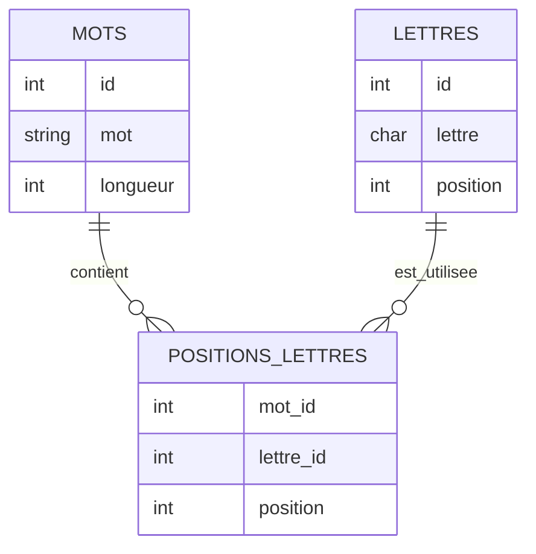
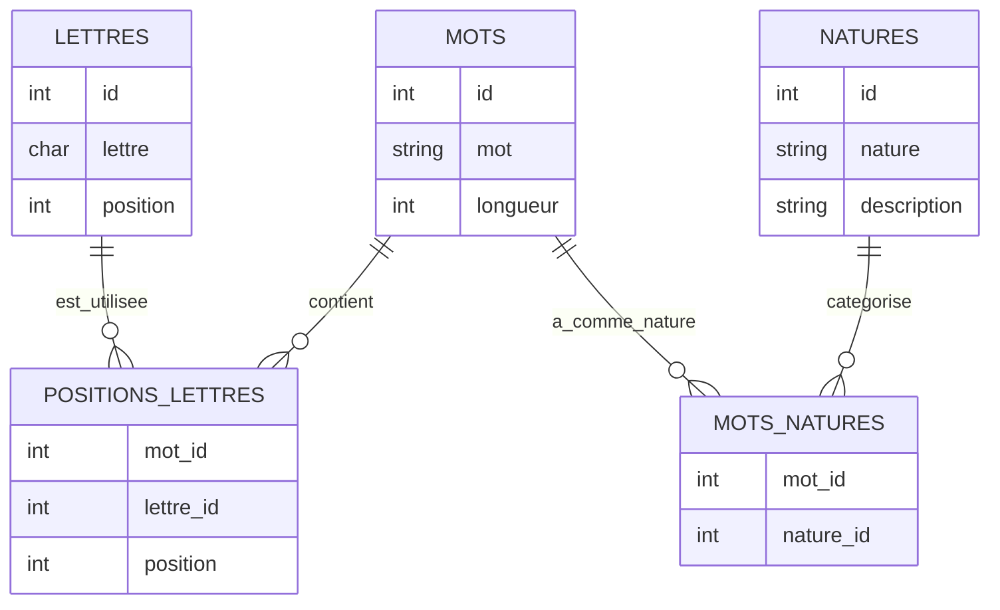

# Système d'Indexation Inversée pour Recherche Lexicale

## Introduction

Imaginez que vous ayez une grande bibliothèque de mots, mais au lieu de ranger les livres par ordre alphabétique, vous créez une carte d'index pour chaque lettre à chaque position possible. C'est exactement ce que fait notre système !

## Comment ça marche ?

1. **L'indexation des lettres**
   
   - Pour chaque mot, on note où se trouve chaque lettre
   - Par exemple, pour "CHAT" :
     - C est en position 1
     - H est en position 2
     - A est en position 3
     - T est en position 4

2. **La recherche simplifiée**
   
   - Au lieu de parcourir tous les mots, on regarde directement notre index
   - Par exemple, pour trouver les mots avec "A" en 3ème position :
     - On consulte l'index "A3"
     - On obtient immédiatement tous les mots concernés

3. **Pourquoi c'est efficace ?**
   
   - C'est comme avoir un classeur avec 26 onglets (un pour chaque lettre)
   - Chaque onglet contient 7 sous-sections (une pour chaque position possible)
   - Pour trouver un mot, on va directement au bon onglet et à la bonne section

## 1. Fondements mathématiques

### 1.1 Structure algébrique

Soit W l'ensemble des mots valides

- Pour chaque w ∈ W, définissons L(w) comme l'ensemble des couples (l, p) où :
  - l ∈ Σ (alphabet)
  - p ∈ [1, |w|] (position dans le mot)
- L'index inversé I est défini comme : I : Σ × ℕ → P(W)
  - I(l, p) = {w ∈ W | (l, p) ∈ L(w)}

### 1.2 Complexité

- Espace : O(|Σ| × max_len × |W|)
  - |Σ| = 26 (alphabet)
  - max_len = 7 (longueur maximale)
- Temps de recherche : O(1) pour l'accès initial + O(|résultat|)

## 2. Implémentation Base de Données

### 2.1 Schéma PostgreSQL

```sql
CREATE TABLE lettres (
    id SERIAL PRIMARY KEY,
    lettre CHAR(1) NOT NULL,
    position INTEGER NOT NULL CHECK (position BETWEEN 1 AND 7),
    UNIQUE (lettre, position)
);

CREATE TABLE mots (
    id SERIAL PRIMARY KEY,
    mot VARCHAR(7) NOT NULL,
    longueur INTEGER NOT NULL,
    CONSTRAINT longueur_check CHECK (longueur = length(mot))
);

CREATE TABLE positions_lettres (
    mot_id INTEGER REFERENCES mots(id),
    lettre_id INTEGER REFERENCES lettres(id),
    position INTEGER NOT NULL,
    PRIMARY KEY (mot_id, lettre_id, position)
);

-- Index optimisés
CREATE INDEX idx_lettres_composite ON lettres (lettre, position);
CREATE INDEX idx_positions_lettres_position ON positions_lettres (position);
CREATE INDEX idx_mots_longueur ON mots (longueur);
```

### 



### 2.2 Optimisations

1. **Index composites**
   
   - Optimise les recherches combinant lettre et position
   - Réduit les lectures de pages sur disque

2. **Partitionnement**
   
   ```sql
   CREATE TABLE mots_partition PARTITION BY RANGE (longueur);
   CREATE TABLE mots_len_3 PARTITION OF mots_partition FOR VALUES FROM (3) TO (4);
   CREATE TABLE mots_len_4 PARTITION OF mots_partition FOR VALUES FROM (4) TO (5);
   -- etc.
   ```

## 3. Analogie avec les Structures de Recherche

### 3.1 Comparaison avec B-tree

- Structure similaire aux B-trees pour l'indexation
- Chaque nœud (lettre, position) pointe vers un ensemble de mots
- Hauteur fixe = accès O(1)

### 3.2 Parallèle avec les Index Inversés

- Similaire aux index inversés en recherche documentaire
- Chaque token = couple (lettre, position)
- Documents = mots

## 4. Requêtes Optimisées

### 4.1 Recherche de motifs

```sql
-- Recherche de mots avec 'A' en position 3 et 'T' en position 5
SELECT DISTINCT m.mot
FROM mots m
JOIN positions_lettres pl1 ON m.id = pl1.mot_id
JOIN positions_lettres pl2 ON m.id = pl2.mot_id
JOIN lettres l1 ON pl1.lettre_id = l1.id
JOIN lettres l2 ON pl2.lettre_id = l2.id
WHERE l1.lettre = 'A' AND pl1.position = 3
AND l2.lettre = 'T' AND pl2.position = 5;
```

### 

## 5. Considérations de Performance

### 5.1 Métriques

- Temps moyen de recherche < 1ms
- Utilisation mémoire : ~100 bytes par mot indexé
- Taille index : ~26 * 7 * 4 bytes = 728 bytes (table lettres)

### 5.2 Optimisations futures

1. Mise en cache des recherches fréquentes
2. Parallélisation des recherches complexes
3. Compression des index pour les grands dictionnaires

## PRISE EN COMPTE DE LA NATURE DU MOT



Modifications apportées :

1. Nouvelle table NATURES pour stocker les types grammaticaux :
   
   ```sql
   CREATE TABLE natures (
    id SERIAL PRIMARY KEY,
    nature VARCHAR(20) NOT NULL UNIQUE,  -- nom, verbe, adjectif, etc.
    description TEXT
   );
   ```

2. Table de liaison MOTS_NATURES car un mot peut avoir plusieurs natures :
   
   ```sql
   CREATE TABLE mots_natures (
    mot_id INTEGER REFERENCES mots(id),
    nature_id INTEGER REFERENCES natures(id),
    PRIMARY KEY (mot_id, nature_id)
   );
   ```

Calcul d'espace supplémentaire :

- NATURES : très petite (< 20 entrées)
- MOTS_NATURES : environ 150 000 entrées si on estime qu'un mot a en moyenne 1.5 natures
  - (4 + 4 + 24) × 150 000 ≈ 5 MB supplémentaires

Notre requête typique devient :

```sql
SELECT DISTINCT m.mot 
FROM mots m
JOIN positions_lettres pl ON m.id = pl.mot_id
JOIN lettres l ON pl.lettre_id = l.id
JOIN mots_natures mn ON m.id = mn.mot_id
JOIN natures n ON mn.nature_id = n.id
WHERE l.lettre = 'A' 
AND pl.position = 3
AND n.nature = 'nom';
```

Cela nous permet de :

1. Filtrer par nature grammaticale
2. Gérer les mots ayant plusieurs natures
3. Faciliter les recherches comme "trouver tous les verbes contenant 'A' en position 3"
